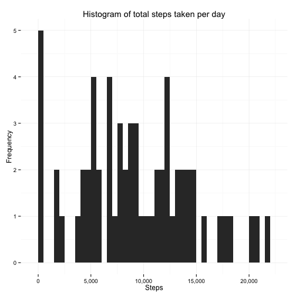
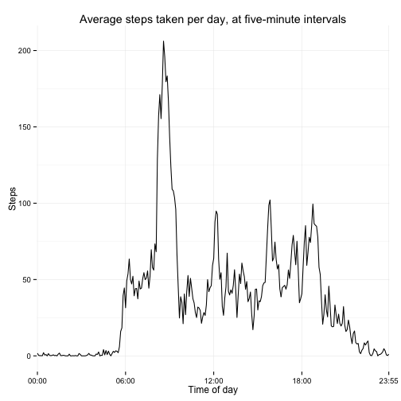
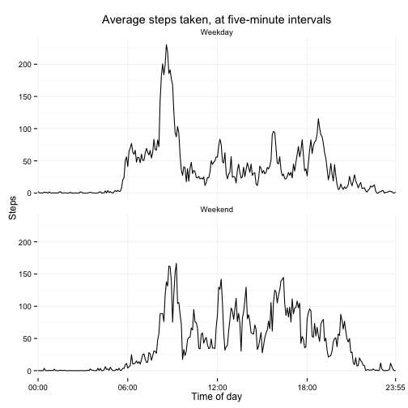

This is a solution for the first peer assessment for Johns Hopkins University's
Reproducible Research course, taken during December 2015. The assignment makes
use of two months of data, collected from an anonymous individual during October
and November 2012, that consists of the number of steps taken at five-minute
intervals each day.

First we should load the libraries. We'll be using `readr` for reading the CSV,
`dplyr` for manipulating the data table (and for access to `magrittr`),
`stringr` to help convert the intervals into a time of day, `lubridate` to
manipulate dates and times, `ggplot2` to output plots, and finally `scales` for
its `comma` function.


```r
library(dplyr)
library(ggplot2)
library(lubridate)
library(readr)
library(scales)
library(stringr)
```

Now we're ready to load the data from the source CSV file. It's unzipped and
processed so that the first column (`steps`) is parsed as an integer, the second
(`date`) as a date, and the third (`interval`) as an integer. After that,
`interval` is converted to a time of day and then merged with `date` to create a
`datetime` column. Finally, the `date` and `interval` columns are discarded so
we're left with a two-column data table.


```r
activity <- read_csv("activity.zip", col_types = "iDi") %>%
  mutate(datetime = parse_datetime(paste(date, str_pad(interval, 4, "left", 0)), 
                                   "%Y-%m-%d %H%M")) %>%
  select(datetime, steps)

summary(activity)
```

```
##     datetime                       steps       
##  Min.   :2012-10-01 00:00:00   Min.   :  0.00  
##  1st Qu.:2012-10-16 05:58:45   1st Qu.:  0.00  
##  Median :2012-10-31 11:57:30   Median :  0.00  
##  Mean   :2012-10-31 11:57:30   Mean   : 37.38  
##  3rd Qu.:2012-11-15 17:56:15   3rd Qu.: 12.00  
##  Max.   :2012-11-30 23:55:00   Max.   :806.00  
##                                NA's   :2304
```

Now we're ready to answer the questions asked in the assignment. We can
calculate the total number of steps taken each day, and then plot a histogram of
the data.


```r
steps.per.day <- activity %>%
  mutate(date = round_date(datetime, "day")) %>%
  group_by(date) %>%
  summarise(steps = sum(steps, na.rm = TRUE))

ggplot(steps.per.day, aes(steps)) +
  geom_histogram(binwidth=500) +
  labs(title = "Histogram of total steps taken per day",
       x = "Steps",
       y = "Frequency") +
  scale_x_continuous(labels=comma) +
  theme_minimal()
```

 

Using the same data, we can show the mean and median of the total number of
steps taken each day.


```r
mean(steps.per.day$steps, na.rm = TRUE)
```

```
## [1] 9203.355
```

```r
median(steps.per.day$steps, na.rm = TRUE)
```

```
## [1] 8956
```


Next we can make a time-series plot of the five-minute interval (shown on the
x-axis) and the number of steps taken, averaged across all days (y-axis).


```r
activity.by.intervals <- activity %>%
  mutate(hour.minute = strftime(datetime, "%H:%M")) %>%
  group_by(hour.minute) %>%
  summarise(avg = mean(steps, na.rm = T))

ggplot(activity.by.intervals, aes(hour.minute, avg)) +
  geom_line(aes(group = 1)) +
  scale_x_discrete(breaks = c("00:00", "06:00", "12:00", "18:00", "23:55")) +
  labs(title = "Average steps taken per day, at five-minute intervals",
       x = "Time of day",
       y = "Steps") +
  theme_minimal()
```

 

Using the same data we can show which five-minute interval, on average across
all the days in the dataset, contains the maximum number of steps.


```r
(activity.by.intervals %>% arrange(desc(avg)))$hour.minute[1]
```

```
## [1] "08:35"
```

The total number of missing values in the `steps` column is 2,304:


```r
activity %>% count(is.na(steps))
```

```
## Source: local data frame [2 x 2]
## 
##   is.na(steps)     n
##          (lgl) (int)
## 1        FALSE 15264
## 2         TRUE  2304
```

We next want to create a new dataset equivalent to the original but with the
missing data filled in. As a strategy for filling in the missing values we use
the mean for that five-minute interval by reusing the `activity.by.intervals`
variable created earlier.


```r
activity.no.nas <- activity %>%
  mutate(steps = ifelse(is.na(steps),
                        activity.by.intervals[activity.by.intervals$hour.minute == strftime(datetime, "%H:%M")]$avg,
                        steps))
activity.no.nas %>% count(is.na(steps))
```

```
## Source: local data frame [1 x 2]
## 
##   is.na(steps)     n
##          (lgl) (int)
## 1        FALSE 17568
```

Now we can see a new histogram of the total number of steps taken each day, with
the missing values filled in.


```r
steps.per.day.no.nas <- activity.no.nas %>%
  mutate(date = round_date(datetime, "day")) %>%
  group_by(date) %>%
  summarise(steps = sum(steps, na.rm = TRUE))

ggplot(steps.per.day.no.nas, aes(steps)) +
  geom_histogram(binwidth=500) +
  labs(title = "Histogram of total steps taken per day (NAs removed)",
       x = "Steps",
       y = "Frequency") +
  scale_x_continuous(labels=comma) +
  theme_minimal()
```

 

Does filling in the missing values alter the mean and median values reported
earlier?


```r
mean(steps.per.day.no.nas$steps, na.rm = TRUE)
```

```
## [1] 10592.54
```

```r
median(steps.per.day.no.nas$steps, na.rm = TRUE)
```

```
## [1] 10568.09
```

Yes, it does. The impact of imputing missing data on the estimates of the total
daily number of steps is to increase both the median and the mean averages.

Finally, we want to see if there are differences in activity patterns between
weekdays and weekends. To do this we create a new factor variable with two
levels, 'weekday' and 'weekend', to indicate whether a given date is a weekday
or weekend day.


```r
activity.no.nas <- activity.no.nas %>%
  mutate(day.type = factor(ifelse(wday(datetime) %in% c(1, 7),
                                  "Weekend", "Weekday")))
```

Now we can make a panel plot containing a time series plot of the five-minute
interval and the number of steps taken, averaged across weekdays or weekends.


```r
activity.by.intervals.na.nas <- activity.no.nas %>%
  mutate(hour.minute = strftime(datetime, "%H:%M")) %>%
  group_by(hour.minute, day.type) %>%
  summarise(avg = mean(steps, na.rm = T))

ggplot(activity.by.intervals.na.nas, aes(hour.minute, avg)) +
  geom_line(aes(group = 1)) +
  scale_x_discrete(breaks = c("00:00", "06:00", "12:00", "18:00", "23:55")) +
  labs(title = "Average steps taken, at five-minute intervals",
       x = "Time of day",
       y = "Steps") +
  facet_wrap(~ day.type, nrow = 2, ncol = 1) +
  theme_minimal()
```

 

And with that, we're done.
